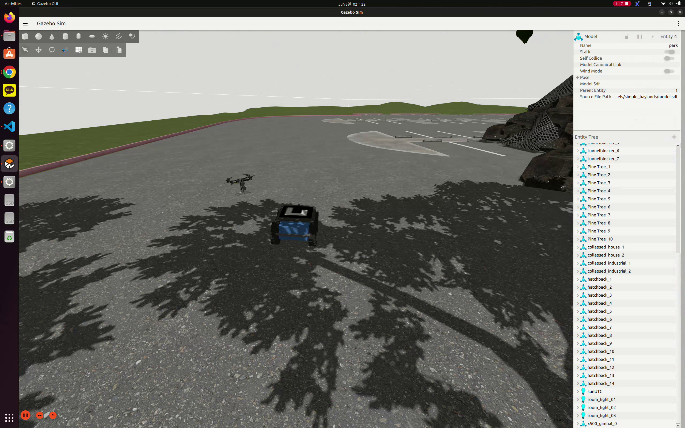

# ASP ROS2 Workspace

## 최신 변경 사항

### 2026-06-18: UGV 속도 상향 및 착륙 prealign gate 추가

* Mission1 UGV carrier 속도 기본값을 `4.0 m/s`로 올렸다.
  * `mission1_cruise_speed`, `mission1_max_linear_speed`, `mission1_min_linear_speed`: `4.0`
  * Mission1 종료부 감속 설정은 기존 값 그대로 유지했다.
* Mission3 rendezvous 일반 주행 속도도 `4.0 m/s`로 올렸다.
  * `mission3_cruise_speed`, `mission3_max_linear_speed`: `4.0`
  * 초기 저속 boost 전환 시간을 줄여 Mission3 초반 병목을 완화했다.
* UAV landing phase에 prealign gate를 추가했다.
  * landing target과의 XY 오차가 `landing_prealign_xy_tolerance_m: 2.5`보다 크면 하강하지 않고 `prelanding_altitude_m: 8.0` 기준 고도를 유지한다.
  * UGV/ArUco target 위에 먼저 정렬한 뒤 기존 하강 로직으로 넘어가도록 해, 먼 거리 이동과 하강이 동시에 일어나며 옆으로 착륙하는 문제를 줄인다.
  * 낮은 고도에서도 XY가 충분히 맞지 않으면 landing target lock이 걸리지 않도록 보정했다.
* 검증 기록
  * `python3 -m py_compile src/asp_final_uav/asp_final_uav/uav_mission_node.py`
  * `colcon build --packages-select asp_final_uav --symlink-install`
  * `colcon build --packages-select asp_final_ugv --symlink-install`

### 2026-06-18: Prelanding target lock 및 착륙 drift 완화

* Mission2 완료 직후 UAV가 landing start를 기다리는 동안 UGV landing marker 상공으로 미리 접근하도록 했다.
  * `mission2_complete_preposition_enabled`를 활성화했다.
  * prelanding 목표 고도는 `prelanding_altitude_m: 8.0` 기준으로 사용한다.
  * prelanding 중 목표 XY가 2 m 이내로 가까워지면 target을 lock하여 계속 움직이는 TF를 과도하게 추종하지 않도록 했다.
* 착륙 phase에서 prelanding target을 이어받도록 수정했다.
  * landing start 시점에 target을 초기화하지 않고, 직전 prelanding target을 초기 landing target으로 사용한다.
  * ArUco 검출 target은 고도 여유가 있을 때만 갱신한다.
  * 검출 pose가 튀더라도 한 cycle에 최대 `0.7 m`만 landing target을 이동시켜 lateral drift를 줄인다.
* Mission2 UAV 첫 번째 waypoint 고도를 `10 m`로 조정했다.
  * marker roof scan 진입 시간을 줄이되, 이후 waypoint 고도는 기존 값을 유지한다.
* Mission1 UGV carrier 속도 기본값을 `3.3 m/s`로 올렸다.
  * `mission1_cruise_speed`, `mission1_max_linear_speed`, `mission1_min_linear_speed`: `3.3`
  * 가속/각속도 제한은 기존 시험 튜닝값을 유지한다.
* UAV marker CSV 저장 로직을 개선했다.
  * 단순 마지막 검출값 대신, 각 marker waypoint에 가장 가까웠던 순간의 marker pose를 대표값으로 저장한다.
  * CSV에 `best_seen_time_sec`, `best_wp_distance_m`, waypoint tag/좌표 필드를 추가했다.
* 검증 기록
  * `python3 -m py_compile src/asp_final_uav/asp_final_uav/uav_mission_node.py`
  * `colcon build --packages-select asp_final_uav --symlink-install`

### 2026-06-18: Mission1 pre-roll 및 ArUco 중심 착륙 튜닝

* Mission1 주행 중 UAV offboard setpoint pre-roll을 미리 수행하도록 추가했다.
  * `/asp_final/mission/state == MISSION1_CARRIER` 동안 UAV 현재 pose를 `/asp_final/uav/cmd_pose`로 계속 발행한다.
  * PX4 bridge는 setpoint counter와 map/PX4 anchor를 미리 준비한다.
  * `/asp_final/uav/offboard_command_enable`이 true가 되기 전에는 OFFBOARD/ARM 요청을 막아 Mission1 중 의도치 않은 이륙을 방지한다.
  * Mission2 시작 시 command gate를 열어 pre-roll 이후 바로 OFFBOARD/ARM 요청이 가능하도록 했다.
* 착륙 완료 전 조기 disarm 문제를 줄이기 위해 PX4 bridge의 일반 `vehicle_land_detected.landed=true` 기반 자동 disarm 경로를 제거했다.
  * `/asp_final/uav/land`가 요청된 landing phase에서만 disarm 후 `/command/disarm`을 발행하도록 제한했다.
  * `mission_timer_node`는 수정하지 않고, 타이머 종료 조건에 맞는 disarm 타이밍만 bridge에서 보정했다.
* UAV precision landing을 ArUco marker 10 검출 중심 기준으로 변경했다.
  * `landing_use_detection_pose_as_target`을 활성화하고 고정 landing offset을 `0.0`으로 변경했다.
  * marker 검출 pose가 유효하면 해당 map 좌표를 landing target으로 latch한다.
  * marker 검출이 잠깐 끊기면 마지막 검출 target을 유지하고, 검출 전에는 UGV marker TF를 fallback으로 사용한다.
* 착륙 속도와 안정 조건을 튜닝했다.
  * `landing_descent_step_m`을 `3.4`로 높여 최종 하강을 빠르게 했다.
  * LAND 명령은 XY 오차 `0.20 m` 이내가 안정적으로 유지될 때 발행한다.
  * marker loss 상태에서도 target 근처/접근 고도 이하에서는 하강을 이어갈 수 있게 했다.
* Mission1 UGV carrier 속도 기본값을 시험 튜닝값으로 올렸다.
  * `mission1_cruise_speed`, `mission1_max_linear_speed`, `mission1_min_linear_speed`: `2.7`
  * `mission1_max_linear_accel`: `3.5`
  * `mission1_max_angular_speed`: `2.8`
  * `mission1_max_angular_accel`: `3.0`
* 검증 기록
  * `colcon build --packages-select asp_final_uav asp_final_px4_bridge`
  * `colcon build --packages-select asp_final_uav`
  * 최근 타이머 기준 Mission total time: `86.48 s`

### 2026-06-17: Final mission TF 및 착륙 안정화

* Gazebo pose TF 중 모델 내부 link transform이 `map -> base_link` alias를 덮어쓰지 않도록 수정했다.
  * `X1_asp/base_link`, `x500_gimbal_0/base_link` 내부 link transform은 로봇 월드 pose 판정에서 제외한다.
  * `X1_asp`, `x500_gimbal_0` 모델 루트 transform만 UGV/UAV 위치 alias에 사용한다.
* UAV 착륙 로직을 UGV/landing marker 높이 기준으로 변경했다.
  * 절대 고도 `z=0` 기준 하강 대신 `UGV/marker z + offset` 기준으로 최종 접근한다.
  * marker 10 검출이 없으면 최종 하강을 막고 접근 고도에서 대기한다.
  * `/asp_final/landing/complete`는 PX4 `vehicle_land_detected.landed` 확인 후 발행한다.
* 착륙 디버깅을 위해 `LANDING_STATUS` 로그에 XY 오차, 현재 고도, 목표 고도, marker 사용 여부, landed 상태를 출력한다.

## 목적

이 문서는 `jsb` 브랜치 기준으로 ASP ROS2 workspace에서 변경한 제어 구조와 실행 방법을 정리한다. 원래 브랜치/원본 코드 대비 UAV와 UGV 명령 토픽이 섞일 수 있는 문제를 분리하고, UGV 전용 keyboard control과 Gazebo bridge를 추가한 내용을 설명한다.

## 프로젝트 개요

이 저장소는 ASP 자율주행 시스템 플랫폼 실험을 위한 ROS2 workspace이다. PX4 SITL + Gazebo 환경과 연동하여 UAV/UGV 제어 실험을 수행한다.

기존 제공 패키지를 기반으로 UGV 전용 keyboard control과 bridge를 추가했다. 최종 목표는 UAV 제어 명령과 UGV 제어 명령을 서로 다른 ROS2 topic으로 분리하여 두 차량을 독립적으로 운용하는 것이다.

## 기존 문제 구조

기존 `keyboard_control_node`는 `/command/twist`를 publish했고, 이 토픽은 UAV offboard control에 사용되었다.

```text
keyboard_control_node
  -> /command/twist
  -> offboard_control
  -> PX4 UAV control
```

UGV를 임시로 움직이기 위해 다음 bridge를 사용했을 때 문제가 발생했다.

```bash
ros2 run ros_gz_bridge parameter_bridge \
  "/model/X1_asp/cmd_vel@geometry_msgs/msg/Twist]gz.msgs.Twist" \
  --ros-args -r /model/X1_asp/cmd_vel:=/command/twist
```

이 구조에서는 UAV와 UGV가 같은 `/command/twist`를 공유한다.

```text
/command/twist
  +- UAV offboard_control
  +- UGV Gazebo DiffDrive
```

따라서 UGV keyboard 입력이 UAV offboard control로 전달될 수 있고, UAV 명령과 UGV 명령이 섞일 위험이 있다.

## 최종 수정 구조

UAV와 UGV 명령 토픽을 다음과 같이 분리했다.

```text
[UAV Control]
keyboard_control_node
  -> /command/twist
  -> offboard_control
  -> /fmu/in/trajectory_setpoint
  -> x500_gimbal_0

[UGV Control]
ugv_keyboard_control_node
  -> /command/ugv_cmd_vel
  -> ros_gz_bridge
  -> /model/X1_asp/cmd_vel
  -> X1_asp
```

정리하면 다음과 같다.

```text
/command/twist       = UAV 전용
/command/ugv_cmd_vel = UGV 전용
```

## 변경 사항

| File | Type | Description |
| --- | --- | --- |
| `utilities_pkg/src/ugv_keyboard_control_node.cpp` | Added | UGV 전용 keyboard control node |
| `utilities_pkg/CMakeLists.txt` | Modified | `ugv_keyboard_control_node` executable 및 install target 추가 |
| `gazebo_env_setup/launch/ugv_bridge.launch.py` | Added | `/command/ugv_cmd_vel` -> `/model/X1_asp/cmd_vel` bridge |
| `utilities_pkg/package.xml` | Modified | `std_msgs` dependency 반영 |
| `gazebo_env_setup/package.xml` | Modified | `std_msgs`, `tf2_msgs` dependency 반영 |
| `gazebo_env_setup/CMakeLists.txt` | Modified | `std_msgs`, `tf2_msgs` `find_package` 및 target dependency 반영 |

## UGV Keyboard Node

* Node name: `ugv_keyboard_control_node`
* Publish topic: `/command/ugv_cmd_vel`
* Message type: `geometry_msgs/msg/Twist`
* Publish rate: 20 Hz
* Control fields: `linear.x`, `angular.z`
* Differential drive 차량이므로 `linear.y`는 사용하지 않음

키 매핑은 다음과 같다.

```text
w : forward
x : backward
a : turn left
d : turn right
s or Space : stop
h : help
Ctrl+C : quit
```

## UGV Bridge

* Launch file: `gazebo_env_setup/launch/ugv_bridge.launch.py`
* ROS2 topic: `/command/ugv_cmd_vel`
* Gazebo topic: `/model/X1_asp/cmd_vel`
* Bridge direction: ROS2 -> Gazebo
* Bridge expression:

```text
/model/X1_asp/cmd_vel@geometry_msgs/msg/Twist]gz.msgs.Twist
```

## 빌드 방법

```bash
cd ~/ros2_ws

source /opt/ros/humble/setup.bash
source install/setup.bash 2>/dev/null || true

colcon build --packages-select utilities_pkg gazebo_env_setup

source install/setup.bash
```

성공 기준은 다음과 같다.

```text
Summary: 2 packages finished
```

## 실행 방법

### UGV 실험

Terminal 1: PX4/Gazebo 실행

```bash
cd ~/PX4-Autopilot_ASP
make px4_sitl gz_x500_gimbal
```

Terminal 2: UGV bridge 실행

```bash
px4humble
source ~/ros2_ws/install/setup.bash
ros2 launch gazebo_env_setup ugv_bridge.launch.py
```

Terminal 3: UGV keyboard 실행

```bash
px4humble
source ~/ros2_ws/install/setup.bash
ros2 run utilities_pkg ugv_keyboard_control_node
```

Terminal 4: UGV command topic 확인

```bash
px4humble
source ~/ros2_ws/install/setup.bash
ros2 topic echo /command/ugv_cmd_vel
```

### UAV 실험

Terminal 1: PX4/Gazebo 실행

```bash
cd ~/PX4-Autopilot_ASP
make px4_sitl gz_x500_gimbal
```

Terminal 2: QGroundControl 실행

```bash
chmod +x QGroundControl.AppImage
./QGroundControl.AppImage
```

Terminal 3: UAV interface 실행

```bash
px4humble
source ~/ros2_ws/install/setup.bash
ros2 launch gazebo_env_setup turn_interfaces.launch.py
```

Terminal 4: UAV keyboard 실행

```bash
px4humble
source ~/ros2_ws/install/setup.bash
ros2 run utilities_pkg keyboard_control_node
```

## 검증 방법

UGV topic을 확인한다.

```bash
ros2 topic list | grep ugv
```

UAV command topic을 확인한다.

```bash
ros2 topic list | grep /command/twist
```

UGV keyboard만 눌렀을 때 다음 topic에는 값이 나와야 한다.

```bash
ros2 topic echo /command/ugv_cmd_vel
```

반대로 다음 topic에는 값이 나오지 않아야 한다.

```bash
ros2 topic echo /command/twist
```

이 결과가 확인되면 UGV keyboard control이 UAV용 `/command/twist`와 분리되어 동작하는 것이다.

## 사용 금지 명령

다음 임시 bridge 명령은 더 이상 사용하지 않는다.

```bash
ros2 run ros_gz_bridge parameter_bridge \
  "/model/X1_asp/cmd_vel@geometry_msgs/msg/Twist]gz.msgs.Twist" \
  --ros-args -r /model/X1_asp/cmd_vel:=/command/twist
```

이 명령은 `/command/twist`가 UAV와 UGV에 동시에 연결되어 명령이 섞일 수 있으므로 사용하지 않는다.

## 변경 기록: RViz Camera Bridge 수정

작성 시각: `2026-06-02 21:43:09 KST`

RViz에서 `UAV_Image`, `UGV_Image`, `Marker Detected` 패널에 `No Image`가 표시되는 문제를 확인했다. 핵심 원인은 현재 Gazebo 모델 topic은 `X1_asp`, `x500_gimbal_0` 기준으로 생성되어 있는데, bridge 설정에는 예전 camera topic이 남아 있어 image topic이 ROS2로 전달되지 않는 점이었다.

이번 수정에서는 `gazebo_env_setup/launch/bridge_and_tf.launch.py`의 `bridge_args`를 현재 실제 Gazebo topic 기준으로 갱신했다.

```text
/world/default/model/x500_gimbal_0/link/camera_link/sensor/camera/image
/world/default/model/x500_gimbal_0/link/camera_link/sensor/camera/camera_info
/world/default/model/X1_asp/link/base_link/sensor/camera_front/image
/world/default/model/X1_asp/link/base_link/sensor/camera_front/camera_info
/world/default/model/X1_asp/link/base_link/sensor/gpu_lidar/scan/points
/world/default/model/x500_gimbal_0/link/base_link/sensor/imu_sensor/imu
/world/default/model/x500_gimbal_0/link/camera_link/sensor/camera_imu/imu
```

또한 `gazebo_env_setup/config/asp_final_proj.rviz`에서 RViz display QoS를 Gazebo bridge topic과 맞추기 위해 다음 display의 Reliability Policy를 `Best Effort`로 변경했다.

```text
UAV_Image
UGV_Image
GPU_LiDAR
```

RViz display topic은 다음 값을 사용한다.

```text
UAV_Image: /world/default/model/x500_gimbal_0/link/camera_link/sensor/camera/image
UGV_Image: /world/default/model/X1_asp/link/base_link/sensor/camera_front/image
GPU_LiDAR: /world/default/model/X1_asp/link/base_link/sensor/gpu_lidar/scan/points
```

빌드는 다음 명령으로 확인했다.

```bash
colcon build --packages-select gazebo_env_setup
```

제어 코드, keyboard node, UGV bridge, PX4 파일은 수정하지 않았다.

## 변경 기록: Gazebo Pose TF Bridge 수정

작성 시각: `2026-06-02 22:24:49 KST`

RViz에서 camera image는 표시되지만 TF tree에 실제 모델 frame인 `X1_asp/base_link`, `x500_gimbal_0/base_link`가 보이지 않는 문제를 확인했다. 원인은 Gazebo의 pose topic이 ROS2로 bridge되지 않았고, `pose_tf_broadcaster`도 `bridge_and_tf.launch.py`에서 실행되지 않는 구조였기 때문이다.

이번 수정에서는 `gazebo_env_setup/launch/bridge_and_tf.launch.py`에 다음 Gazebo pose topic bridge를 추가했다.

```text
/model/X1_asp/pose
/model/X1_asp/pose_static
/model/x500_gimbal_0/pose
/model/x500_gimbal_0/pose_static
```

같은 launch 파일에서 `pose_tf_broadcaster` node도 함께 실행되도록 추가했다.

```text
gazebo_env_setup/pose_tf_broadcaster
```

기존 launch에 남아 있던 `x500_depth_0` 기준 static TF publisher들은 현재 모델명과 맞지 않아 제거했다. 현재 모델 기준은 다음과 같다.

```text
X1_asp
x500_gimbal_0
```

`gazebo_env_setup/src/pose_tf_broadcaster.cpp`는 다음 topic을 모두 구독하도록 수정했다.

```text
/model/X1_asp/pose
/model/X1_asp/pose_static
/model/x500_gimbal_0/pose
/model/x500_gimbal_0/pose_static
```

수신한 transform의 parent frame이 `default`이면 `map`으로 바꾸고, child frame은 Gazebo가 제공하는 이름을 그대로 유지한다. 따라서 RViz/tf2에서 다음 frame을 확인할 수 있어야 한다.

```text
map
X1_asp/base_link
x500_gimbal_0/base_link
```

빌드는 다음 명령으로 확인했다.

```bash
colcon build --packages-select gazebo_env_setup
```

실행 중인 `turn_interfaces.launch.py`는 재시작해야 새 pose bridge와 `pose_tf_broadcaster`가 적용된다.

```bash
ros2 launch gazebo_env_setup turn_interfaces.launch.py
ros2 run tf2_ros tf2_echo map X1_asp/base_link
ros2 run tf2_ros tf2_echo map x500_gimbal_0/base_link
```

제어 코드, keyboard node, UGV bridge, image bridge topic, PX4/default.sdf는 수정하지 않았다.

## 변경 기록: Mission1 UGV Path Follower 추가

작성 시각: `2026-06-03 00:12:53 KST`

Mission1 구현 시작을 위해 새 패키지 `asp_ugv_control`을 추가했다. 목표는 UGV `X1_asp`가 `mission.csv` waypoint를 저속으로 따라가고, `mission_type=2` waypoint에 도착하면 Mission2 시작 지점으로 판단하여 정지하는 것이다.

전체 명령 흐름은 다음과 같다.

```text
ugv_path_follower_node
  -> /command/ugv_cmd_vel
  -> ugv_cmd_vel_bridge
  -> /model/X1_asp/cmd_vel
  -> Gazebo X1_asp
```

새 패키지 구조는 다음과 같다.

```text
src/asp_ugv_control/
├── CMakeLists.txt
├── package.xml
├── config/path_follower_params.yaml
├── docs/MISSION1_UGV_PATH_FOLLOWER.md
├── launch/ugv_path_follower.launch.py
├── path/mission.csv
└── src/ugv_path_follower_node.cpp
```

`ugv_path_follower_node`의 주요 동작은 다음과 같다.

```text
node name: ugv_path_follower_node
output topic: /command/ugv_cmd_vel
TF: map -> X1_asp/base_link
state topic: /ugv/state
event topic: /ugv/mission_event
CSV format: x,y,mission_type,target_speed
```

`mission_type=2` waypoint에 도착하면 zero Twist를 publish하고 정지한다. 이때 `/ugv/state`는 `STOPPED`, `/ugv/mission_event`는 `MISSION2_START_REACHED`를 publish한다.

Mission1 path follower는 다음 제어 개념으로 구성했다.

```text
TF2 기반 현재 pose 조회
waypoint까지 거리 계산
target heading과 현재 yaw의 heading error 계산
waypoint 도달 시 다음 waypoint로 전환
target marker publish
mission_type=2를 Mission2 연결 지점으로 해석
```

현재 workspace 구조에 맞게 다음 제약을 적용했다.

```text
/model/X1_asp/cmd_vel 직접 publish 금지
/command/twist 사용 금지
/command/ugv_cmd_vel만 publish
UAV takeoff/rendezvous topic 연동 제거
Mission1 완료 이벤트를 /ugv/mission_event로 publish
```

빌드와 실행 파일 등록은 다음 명령으로 확인했다.

```bash
colcon build --packages-select asp_ugv_control
ros2 pkg executables asp_ugv_control
```

정상 출력:

```text
asp_ugv_control ugv_path_follower_node
```

실행 순서는 다음과 같다.

```bash
ros2 launch gazebo_env_setup turn_interfaces.launch.py
ros2 launch gazebo_env_setup ugv_bridge.launch.py
ros2 launch asp_ugv_control ugv_path_follower.launch.py
```

검증 명령은 다음과 같다.

```bash
ros2 topic echo /command/ugv_cmd_vel
ros2 topic echo /ugv/state
ros2 topic echo /ugv/mission_event
ros2 run tf2_ros tf2_echo map X1_asp/base_link
```

기존 `utilities_pkg`, UAV keyboard node, UGV keyboard node, `offboard_control.cpp`, `gazebo_env_setup` launch/config, PX4/default.sdf는 수정하지 않았다.

## 변경 기록: Mission2 Trigger FSM 추가

작성 시각: `2026-06-03 01:11:52 KST`

Mission2 진입 조건을 ArUco marker 검출이 아니라 UGV가 Mission1 종료 지점에 도착했는지 여부로 정리했다. 이에 따라 Mission2 Trigger의 주 publisher는 새 `mission_manager_node`가 담당하도록 구성했다.

최종 Mission2 trigger 흐름은 다음과 같다.

```text
ugv_path_follower_node
  -> /ugv/mission_event: MISSION2_START_REACHED
  -> mission_manager_node
  -> /mission/mission2_trigger: true
  -> /mission/state: UAV_TAKEOFF_READY
```

새 패키지 `asp_mission_manager`를 추가했다.

```text
src/asp_mission_manager/
├── asp_mission_manager/mission_manager_node.py
├── config/mission_manager_params.yaml
├── docs/MISSION_FSM.md
├── launch/mission_manager.launch.py
├── package.xml
├── setup.cfg
└── setup.py
```

`mission_manager_node`의 FSM 상태는 다음과 같다.

```text
INIT
READY
MISSION1_RUNNING
MISSION2_TRIGGERED
UAV_TAKEOFF_READY
UAV_TAKEOFF_REQUESTED
```

주요 topic은 다음과 같다.

```text
Subscriptions:
/mission/start
/mission/reset
/ugv/state
/ugv/mission_event
/perception/mission2_trigger

Publishers:
/mission/state
/mission/status
/mission/mission2_trigger
/command/takeoff
```

`/ugv/mission_event`에서 `MISSION2_START_REACHED`를 받으면 `MISSION1_RUNNING` 또는 `READY` 상태에서 `MISSION2_TRIGGERED`로 전환하고, `/mission/mission2_trigger`에 `true`를 한 번 publish한다. 이후 상태는 `UAV_TAKEOFF_READY`가 된다.

`auto_publish_takeoff`는 기본값 `false`로 두었다. 따라서 현재 단계에서는 Mission2 Trigger와 FSM 상태 전환만 확인하고, UAV takeoff 명령 자동 발행은 나중에 활성화한다.

또한 새 패키지 `asp_perception`을 추가했다. 이 패키지는 현재 Mission2 진입 판단의 주체가 아니라, 나중에 marker exploration 또는 precision landing에 사용할 perception 기능으로 유지한다.

```text
src/asp_perception/
├── CMakeLists.txt
├── config/aruco_detector_params.yaml
├── docs/MISSION2_TRIGGER_ARUCO.md
├── launch/ugv_aruco_detector.launch.py
├── package.xml
└── src/ugv_aruco_detector_node.cpp
```

`asp_perception`은 기본값에서 `/mission/mission2_trigger`를 publish하지 않는다. 대신 marker ID `0` 검출 시 `/perception/mission2_trigger`만 publish한다. mission manager는 이 값을 status에 기록만 하고, 현재 FSM 전이는 UGV 위치 도착 event로만 수행한다.

RViz의 Marker Detected display topic은 다음으로 변경했다.

```text
/perception/aruco/annotated
```

빌드는 다음 명령으로 확인했다.

```bash
colcon build --packages-select asp_mission_manager asp_perception
```

정상 실행 파일은 다음과 같다.

```text
asp_mission_manager mission_manager_node
asp_perception ugv_aruco_detector_node
```

Mission manager 단독 검증 명령은 다음과 같다.

```bash
ros2 launch asp_mission_manager mission_manager.launch.py
ros2 topic echo /mission/state
ros2 topic echo /mission/status
ros2 topic echo /mission/mission2_trigger
ros2 topic pub --once /ugv/mission_event std_msgs/msg/String "{data: MISSION2_START_REACHED}"
```

기존 UAV/UGV 제어 코드, keyboard node, bridge launch, PX4/default.sdf는 수정하지 않았다.

## 변경 기록: Mission2 이후 UAV Exploration 준비

작성 시각: `2026-06-03 02:33:00 KST`

Mission1 UGV path follower와 mission manager를 확장하여 Mission1 종료 이후 Mission2 준비 상태와 UAV exploration 준비 흐름을 연결했다. 현재까지 확인된 안정 동작 범위는 다음과 같다.

```text
Mission1 UGV waypoint 주행
  -> mission_type=2 waypoint 도착
  -> /ugv/mission_event: MISSION2_START_REACHED
  -> mission_manager_node
  -> /mission/mission2_trigger: true
  -> /mission/state: UAV_TAKEOFF_READY
  -> Mission2 준비 이륙 동작
```

아래 화면은 Mission1 이후 Mission2 준비 단계에서 UGV 근처에 UAV가 이륙해 있는 Gazebo 확인 화면이다.



이번 변경으로 `asp_mission_manager` FSM에 UAV exploration 준비 상태를 추가했다.

```text
UAV_EXPLORATION_READY
UAV_EXPLORATION_RUNNING
UAV_EXPLORATION_COMPLETE
```

Mission manager는 `/mission/state`와 `/uav/exploration_start`를 통해 `asp_uav_control`의 exploration node와 연결된다. UAV exploration node는 launch만으로 UAV를 움직이지 않도록 구성했다.

```text
start_on_launch: false
start_on_mission_state: true
required_start_state: UAV_EXPLORATION_READY
```

따라서 `/mission/state`가 `UAV_EXPLORATION_READY`가 되거나, 수동으로 `/uav/exploration_start true`가 publish될 때만 `/command/pose` waypoint 명령을 publish한다. IDLE 상태에서는 `/command/pose`를 publish하지 않는다.

새 패키지 `asp_uav_control`을 추가했다.

```text
src/asp_uav_control/
├── asp_uav_control/uav_exploration_node.py
├── config/uav_exploration_params.yaml
├── docs/MISSION4_UAV_EXPLORATION.md
├── launch/uav_exploration.launch.py
└── path/uav_path.csv
```

UAV exploration node의 주요 topic은 다음과 같다.

```text
Subscriptions:
/mission/state
/uav/exploration_start
/perception/uav/marker_detections

Publishers:
/command/pose
/gimbal_pitch_degree
/uav/exploration_state
/uav/exploration_event
/mission/uav_exploration_complete
```

UGV와 UAV waypoint CSV도 현재 패키지 형식에 맞게 정리했다.

```text
UGV Mission1 CSV:
src/asp_ugv_control/path/mission.csv
format: x,y,mission_type,target_speed

UAV waypoint CSV:
src/asp_uav_control/path/uav_path.csv
format: x,y,z,yaw_deg,gimbal_pitch_deg,hold_sec,tag
```

다만 현재 waypoint CSV는 우리 Gazebo map과 완전히 맞는 좌표로 검증된 상태가 아니다. 따라서 다음 단계에서 실제 `map -> X1_asp/base_link`, `map -> x500_gimbal_0/base_link` TF와 marker 배치 기준으로 UGV/UAV waypoint를 다시 측정하고 보정해야 한다.

`asp_perception`에는 UAV ArUco detector node도 추가했다.

```text
src/asp_perception/src/uav_aruco_detector_node.cpp
src/asp_perception/launch/uav_aruco_detector.launch.py
src/asp_perception/config/uav_aruco_detector_params.yaml
src/asp_perception/docs/UAV_ARUCO_DETECTOR.md
```

UAV ArUco detector는 UAV camera image와 camera_info를 구독하고 `/perception/uav/marker_*` 계열 topic을 publish하도록 구성했다. 다만 아직 실제 Gazebo 실행에서 ArUco marker detection node가 정상 검출되는지는 확인하지 못했다. 현재 확인 완료 범위는 Mission1 이후 Mission2 준비 및 이륙 동작까지이다.

RViz의 Marker Detected display topic은 UAV perception 결과 확인을 위해 다음 topic으로 맞췄다.

```text
/perception/uav/aruco/annotated
```

빌드는 다음 명령으로 확인했다.

```bash
colcon build --packages-select asp_uav_control asp_ugv_control asp_mission_manager asp_perception gazebo_env_setup
```

추가로 `mission_logs/`는 runtime detection log가 생성되는 위치이므로 `.gitignore`에 포함했다.

## 변경 기록: UAV Exploration 좌표계 보정 및 성공 확인

작성 시각: `2026-06-03 04:15:44 KST`

UAV exploration 실행 중 UAV가 waypoint를 따라가기는 하지만, 예상한 marker 방향이 아니라 나무와 장애물 쪽으로 이동하는 문제가 있었다. 처음에는 waypoint CSV 좌표가 현재 Gazebo map과 맞지 않는 문제로 의심했지만, marker pose 기반으로 생성한 `uav_path_generated.csv`와 `uav_path_safe.csv`의 marker 좌표가 Gazebo marker spawn pose와 일치하는 것을 확인했다.

확인된 핵심 원인은 CSV가 아니라 좌표계 변환 방식이었다.

```text
/command/pose
  = ROS/Gazebo map ENU 절대좌표

PX4 TrajectorySetpoint
  = PX4 local NED 상대좌표
```

기존 `offboard_control`은 `/command/pose`의 map ENU 절대좌표를 그대로 ENU -> NED 축 변환만 수행했다.

```text
map ENU target: x=-120.26, y=35.85, z=5.40
기존 변환 결과: x=35.85, y=-120.26, z=-5.40
```

이 값은 PX4 local origin 기준 상대좌표가 아니라 Gazebo map 절대좌표를 축만 바꾼 값이어서, UAV가 현재 위치 기준 상승 명령이 아닌 먼 위치로 이동하는 명령처럼 해석될 수 있었다.

이번 수정에서는 `/command/pose` position setpoint에만 map origin offset을 적용했다. 첫 `/command/pose` 수신 시 `map -> x500_gimbal_0/base_link` TF를 lookup하고, 그 위치를 PX4 local 변환용 origin으로 잡는다. 이후 target map ENU에서 origin map ENU를 뺀 local ENU를 만든 뒤 기존 ENU -> NED 변환을 수행한다.

```text
target map ENU = (-120.26, 35.85, 5.40)
origin map ENU = (-120.26, 35.85, 0.40)
local ENU      = (0.00, 0.00, 5.00)
PX4 NED        = (0.00, 0.00, -5.00)
```

이 구조로 `takeoff_climb`가 현재 위치에서 수직 상승하는 명령으로 해석되는 것을 확인했고, UAV exploration이 정상 방향으로 진행되는 것을 확인했다.

추가한 `offboard_control` parameter는 다음과 같다.

```text
use_map_origin_offset: true
auto_set_map_origin_on_first_pose: true
map_origin_x: 0.0
map_origin_y: 0.0
map_origin_z: 0.0
map_frame: map
base_frame: x500_gimbal_0/base_link
publish_debug_setpoints: true
```

좌표 변환 확인을 위해 다음 debug topic을 추가했다.

```text
/debug/offboard/input_pose_enu
/debug/offboard/local_pose_enu
/debug/offboard/setpoint_pose_ned
/debug/offboard/frame_report
```

`/command/twist` manual control은 기존 속도 제어 흐름을 유지하고, map origin offset은 `/command/pose` 기반 position setpoint에만 적용했다. OFFBOARD/ARM runtime recovery, disarm altitude guard, gimbal pitch command도 유지했다.

UAV exploration node에서는 Mission2 Trigger 시점의 실제 UAV 위치를 기준으로 safe prefix를 동적으로 생성하도록 정리했다. UAV는 Mission1 동안 UGV 위에 실려 이동하므로 exploration 시작 위치는 launch 시점이 아니라 `/uav/exploration_start true` 또는 `/mission/state == UAV_EXPLORATION_READY`를 받은 순간의 `map -> x500_gimbal_0/base_link` TF이다.

```text
start signal
  -> current UAV TF lookup
  -> takeoff_climb
  -> safe_altitude
  -> transition_001, transition_002, ...
  -> scan waypoint 후보
```

`uav_path.csv`는 전체 비행 경로가 아니라 marker scan waypoint 후보 목록으로 취급한다. `dynamic_safe_prefix: true`일 때 runtime에서 앞부분에 safe prefix가 자동으로 붙는다. launch 직후에는 여전히 `/command/pose`를 publish하지 않고, start signal 이후에만 waypoint를 publish한다.

경로 생성 및 검증 보조 도구도 추가했다.

```text
tools/path_tools/extract_marker_poses.py
tools/path_tools/generate_uav_path_from_markers.py
tools/path_tools/generate_safe_uav_path.py
tools/path_tools/README_path_generation.md
```

생성 파일은 다음과 같다.

```text
tools/path_tools/marker_poses.csv
src/asp_uav_control/path/uav_path_generated.csv
src/asp_uav_control/path/uav_path_safe.csv
```

`uav_path_generated.csv`는 marker spawn pose 기반 관측 후보이고, `uav_path_safe.csv`는 시작 위치 기준 safe prefix를 앞에 붙인 검증용 후보이다. 기존 `uav_path.csv`는 자동으로 덮어쓰지 않는다.

marker detection 쪽에서는 `/perception/uav/marker_detections`를 `marker_id` key가 있는 구조화된 문자열로 publish하도록 보강했다. exploration node는 `marker_id` 또는 `id` key만 marker ID로 파싱하고, 좌표나 timestamp 숫자는 marker ID로 취급하지 않는다.

이번 시행착오에서 확인한 순서는 다음과 같다.

```text
1. 기존 CSV 좌표가 현재 map과 맞지 않을 가능성을 확인
2. Gazebo marker spawn pose에서 waypoint 후보 자동 생성
3. generated path와 safe path를 별도 CSV로 생성
4. launch가 실제 어떤 CSV를 읽는지 로그와 generated launch로 확인
5. Mission2 Trigger 시점 TF 기준 dynamic safe prefix 생성으로 변경
6. /command/pose는 정상 map ENU 절대좌표임을 확인
7. offboard_control이 PX4 local NED 상대좌표가 아니라 절대좌표를 축 변환만 하고 있던 문제 확인
8. map origin offset 적용 후 local ENU -> PX4 NED 변환으로 보정
9. UAV exploration 정상 방향 진행 확인
```

검증에 사용한 주요 명령은 다음과 같다.

```bash
colcon build --packages-select asp_uav_control asp_perception px4_ros_com
colcon build --packages-select px4_ros_com
ros2 topic echo /debug/offboard/input_pose_enu
ros2 topic echo /debug/offboard/local_pose_enu
ros2 topic echo /debug/offboard/setpoint_pose_ned
ros2 topic echo /debug/offboard/frame_report
ros2 topic echo /uav/exploration_event
ros2 topic echo /command/pose
```

runtime log가 저장되는 `mission_logs/`와 diagnostic log 디렉토리는 git에 포함하지 않도록 `.gitignore`에 정리했다.

## 변경 기록: Mission2 PX4 Local Anchor 이륙 보정

작성 시각: `2026-06-03 14:29:09 KST`

Mission1 동안 UAV와 UGV가 함께 이동한 뒤 Mission2 시작 지점에서 UAV가 이륙할 때,
UAV가 현재 위치에서 상승하지 않고 spawn/home 위치 계열로 돌아가는 문제가 반복되었다.
이전 좌표계 보정은 `/command/pose`의 map ENU 좌표에서 Mission2 map origin만 빼서
PX4 NED setpoint를 만들었다.

```text
target_map_enu - mission2_map_origin_enu
  -> local_enu
  -> ENU_TO_NED(local_enu)
```

이 방식에서는 첫 takeoff target이 Mission2 origin의 z만 올린 값일 때 최종 PX4 setpoint가
다음처럼 된다.

```text
local_enu = (0, 0, +8)
px4_ned   = (0, 0, -8)
```

하지만 PX4 `TrajectorySetpoint.position`은 PX4 local NED absolute setpoint이다.
따라서 `(0, 0, -8)`은 현재 위치에서 8m 상승이 아니라 PX4 local origin의 x=0, y=0 지점에서
z=-8로 해석될 수 있다. 이것이 UAV가 Mission2 지점이 아니라 spawn/home 위치 쪽으로
돌아가는 핵심 원인으로 판단했다.

이번 수정에서는 Mission2 origin latch 시점에 두 기준을 동시에 저장하도록 변경했다.

```text
mission2_map_anchor_enu = /uav/mission2_takeoff_origin
mission2_px4_anchor_ned = /fmu/out/vehicle_local_position at latch time
```

이후 `/command/pose`가 들어오면 아래 변환을 사용한다.

```text
target_map_enu = /command/pose position
delta_map_enu = target_map_enu - mission2_map_anchor_enu
delta_ned = ENU_TO_NED(delta_map_enu)
final_px4_setpoint_ned = mission2_px4_anchor_ned + delta_ned
```

예를 들어 Mission2 순간 PX4 local 위치가 `(64, -117, -1)`이고, map 기준으로 z만 8m
올린 takeoff target이 들어오면 최종 setpoint는 `(64, -117, -9)`가 된다. 즉 x/y는
Mission2 순간 PX4 local 위치를 유지하고 z만 상승한다.

`offboard_control.cpp`의 주요 변경 사항은 다음과 같다.

```text
/fmu/out/vehicle_local_position subscribe 추가
/uav/mission2_takeoff_origin transient_local/reliable subscribe 추가
Mission2 map anchor와 PX4 local NED anchor 동시 저장
/command/pose 수신 전 anchor가 없으면 pose reject
target command가 없을 때 /fmu/in/trajectory_setpoint default zero publish 중지
/debug/offboard/frame_report에 anchor, delta, final setpoint 상태 출력
```

UAV exploration node는 Mission2 시작 event를 기준으로 takeoff origin을 latch하고,
offboard 변환 anchor로 사용한다. 이후 runtime path의 waypoint를 publish하며, 별도 강제 이륙
prefix는 삽입하지 않는다.

```text
/ugv/mission_event: MISSION2_START_REACHED
  -> map -> x500_gimbal_0/base_link TF latch
  -> /uav/mission2_takeoff_origin publish
  -> PATH_FOLLOWING_STARTED
  -> Mission2 runtime path waypoint
  -> EXPLORING
```

Mission2 origin이 latch되지 않았을 때는 start signal이 들어와도
`WAITING_FOR_MISSION2_ORIGIN` 상태에 머물고 `/command/pose`를 publish하지 않는다.
Mission1/tree-zone으로 돌아가는 waypoint는 forbidden return zone guard로 차단한다.

관련 파라미터는 다음과 같다.

```yaml
mission_event_topic: "/ugv/mission_event"
mission2_start_event: "MISSION2_START_REACHED"
mission2_takeoff_origin_topic: "/uav/mission2_takeoff_origin"
use_mission2_latched_origin: true
require_mission2_latched_origin: true
dynamic_safe_prefix: false
allow_generated_path_runtime: false
runtime_path_must_contain: "senior"
block_pose_if_not_latched: true
forbidden_return_zone_enabled: true
```

safe launch도 정리했다. `uav_exploration_safe.launch.py`는 정적 spawn prefix가 들어간
`uav_path_safe.csv`를 런타임 경로로 사용하지 않고, `uav_path_generated.csv`를 scan waypoint
후보로 읽는다. full mission runtime에서는 generated/debug path를 guard로 분리한다.

보조 진단 스크립트도 추가했다.

```text
tools/diagnostics/uav_pose_source_audit.sh
```

이 스크립트는 `/command/pose` publisher, Mission2 origin, offboard debug pose,
PX4 vehicle local position, trajectory setpoint를 한 번씩 수집하고, 정적 spawn/safe path
설정도 함께 출력한다.

문서와 설정은 다음 파일에 반영했다.

```text
src/asp_uav_control/docs/MISSION4_UAV_EXPLORATION.md
src/asp_uav_control/config/uav_exploration_params.yaml
src/asp_uav_control/launch/uav_exploration_safe.launch.py
tools/diagnostics/uav_pose_source_audit.sh
tools/path_tools/generate_takeoff_safe_csv.py
```

빌드는 다음 명령으로 확인했다.

```bash
colcon build --packages-select px4_ros_com asp_uav_control
```

정상 출력:

```text
Summary: 2 packages finished
```

## 변경 기록: Mission2/3 Runtime 경로 가드 및 UGV 전용 지연

작성 시각: `2026-06-04 02:06:45 KST`

Mission2 UAV와 Mission3 UGV가 병렬로 시작되는 흐름은 유지하되, runtime에서 잘못된 경로가 선택되거나
Mission1 command가 Mission3 command를 방해하는 경우를 막도록 정리했다.

전체 미션 launch의 runtime 경로는 다음 기준으로 고정했다.

```text
UAV Mission2 runtime path:
src/asp_uav_control/path/uav_path_mission2_senior.csv

UGV Mission3 runtime path:
src/asp_ugv_control/path/mission3_rendezvous_senior.csv
```

UAV exploration node에는 runtime path guard를 추가했다.

```yaml
allow_generated_path_runtime: false
runtime_path_must_contain: "senior"
```

따라서 generated/debug path가 full mission runtime으로 들어오면 node가 경로를 거부하고
`ERROR:RUNTIME_PATH_REJECTED_GENERATED` event를 publish한다. generated launch는 명시적으로
debug override를 주는 경우에만 generated path를 사용할 수 있다.

Mission2 시작 전후 UAV가 Mission1/tree-zone 쪽으로 돌아가는 명령도 차단했다.

```yaml
forbidden_return_zone_enabled: true
forbidden_return_zone_name: "mission1_tree_zone"
forbidden_return_zone_min_x: -140.0
forbidden_return_zone_max_x: -115.0
forbidden_return_zone_min_y: 35.0
forbidden_return_zone_max_y: 68.0
```

`PATH_FOLLOWING_STARTED` 이후 forbidden return zone 안의 `/command/pose`는 publish하지 않고,
해당 waypoint를 skip한다.

```text
/uav/exploration_event: POSE_BLOCKED_FORBIDDEN_RETURN_ZONE
/uav/exploration_event: WAYPOINT_FORBIDDEN_RETURN_ZONE_SKIP:<tag>
```

이전에 runtime 앞부분에 강제로 붙였던 UAV 이륙 task는 제거했다. 현재 Mission2 runtime은
Mission2 origin latch를 확인한 뒤 고정된 path waypoint를 사용하고, `dynamic_safe_prefix` 기본값도
full mission에서는 `false`로 둔다.

UGV 쪽은 Mission1 path follower가 `MISSION2_START_REACHED` 이후 짧은 zero Twist burst만 publish한 뒤
`/command/ugv_cmd_vel` ownership을 놓도록 했다.

```text
/ugv/mission_event: MISSION2_START_REACHED
/ugv/mission_event: MISSION1_CMD_RELEASED
```

UAV 이륙 시간 때문에 Mission3 UGV에만 start delay를 적용했다. delay는 mission manager나 UAV start가
아니라 `ugv_rendezvous_node` 내부에만 들어간다.

```yaml
start_delay_sec: 1.5
```

동작 순서는 다음과 같다.

```text
MISSION2_START_REACHED
  -> UAV exploration start 즉시 publish
  -> UGV rendezvous_start publish
  -> UGV만 RENDEZVOUS_START_DELAY 상태에서 1.5초 대기
  -> UGV Mission3 path following 시작
```

추가/수정한 진단 도구는 다음과 같다.

```text
tools/diagnostics/mission_path_audit.py
tools/diagnostics/mission_flow_audit.sh
tools/diagnostics/uav_pose_source_audit.sh
tools/diagnostics/ugv_cmd_source_audit.sh
```

진단 기준에는 forced takeoff prefix 제거, runtime path guard, forbidden return zone,
`MISSION1_CMD_RELEASED`, `RENDEZVOUS_START_DELAY` 확인을 포함했다.

빌드와 진단은 다음 명령으로 확인했다.

```bash
colcon build --packages-select asp_uav_control asp_ugv_control asp_mission_manager
python3 tools/diagnostics/mission_path_audit.py
```

## 변경 기록: Final Mission2 UAV 안전 경로 및 빠른 이륙 보정

작성 시각: `2026-06-04 16:05:14 KST`

Final mission stack 기준으로 Mission2 UAV가 marker 검출 위치까지 이동할 때 직선 경로가 건물이나
장애물과 겹칠 수 있는 문제를 줄이도록 `asp_final_uav` runtime waypoint를 재구성했다.

Mission2 marker 검출 순서는 다음과 같이 고정했다.

```text
7 -> 8 -> 1 -> 0 -> 5 -> 2 -> 4 -> 3 -> 6 -> 9
```

검출 waypoint는 실제 Gazebo world의 marker pose를 기준으로 잡았다. 지붕/천장 marker는 marker 상공에서
`gimbal_pitch=-90`으로 내려다보며, 오른쪽 벽면 marker는 marker 오른쪽 바깥에서 marker를 바라보도록
yaw와 gimbal pitch를 계산했다.

기존처럼 marker마다 `roof/E/W/N/S` 후보를 모두 도는 방식은 제거했다. 대신 실제 검출 waypoint 사이에
충돌 회피용 transit waypoint를 추가했다.

```text
marker detect waypoint
  -> 같은 x/y에서 38m 안전 고도까지 상승
  -> 38m 고도에서 수평 이동
  -> 다음 marker 검출 고도로 하강
  -> 다음 marker detect waypoint
```

Mission2 마지막 marker인 `marker_9_roof_detect` 이후에는 바로 Mission2 완료로 끝내지 않고,
UGV rendezvous 최종 지점 상공으로 이동한 뒤 Mission2 완료가 되도록 했다.

```text
marker_9_roof_detect
  -> 38m 안전 고도 상승
  -> UGV rendezvous endpoint 상공 이동
  -> landing_stage_rendezvous
```

따라서 Mission4 landing 시작 시 UAV가 marker zone에서 UGV 쪽으로 낮은 고도로 직선 이동하지 않고,
이미 rendezvous 지점 상공에 있는 상태에서 착륙 단계로 넘어간다.

`mission2_uav_waypoints.csv`의 CSV format은 기존 6개 필드에 선택 필드 `hold_sec`, `tag`를 추가했다.

```text
x,y,z,yaw_rad,gimbal_pitch_deg,marker_budget,hold_sec,tag
```

`uav_mission_node.py`는 기존 6필드 CSV도 그대로 읽을 수 있고, 7번째/8번째 필드가 있으면 다음처럼 사용한다.

```text
hold_sec: 해당 waypoint 도착 후 유지 시간
tag: exploration event와 log에 표시할 waypoint 이름
```

검출 waypoint에는 `hold_sec=4.0`을 넣어 marker 검출 시간을 확보했다. transit waypoint는
`marker_budget=0`, `hold_sec=0.0`으로 두어 검출 대기 없이 이동만 담당한다.

Mission2/3 병렬 시작 시 UAV가 빠르게 위로 빠지도록 takeoff 구간도 보정했다.

```yaml
takeoff_altitude_m: 24.0
hold_after_takeoff_s: 0.0
takeoff_complete_timeout_s: 3.0
```

takeoff phase는 시작 위치에서 24m 목표 고도를 publish하고, 별도 hover 대기 없이 빠르게 transition
corridor로 넘어간다. 3초 안에 목표 고도에 완전히 도달하지 못해도 transition corridor가 같은 위치에서
고도 확보를 이어가므로, 수평 이동 전에 UAV가 충분히 상승하도록 유지된다.

PX4 offboard bridge에는 상승 중 z축 velocity feedforward를 추가했다.

```yaml
fast_climb_velocity_feedforward_mps: 4.0
fast_climb_error_threshold_m: 1.0
```

현재 map z와 target z 차이가 threshold보다 클 때만 `TrajectorySetpoint.velocity`의 z축 feedforward를
넣는다. 하강이나 착륙에는 적용하지 않으므로 landing descent 동작은 기존 흐름을 유지한다.

최종 변경 파일은 다음과 같다.

```text
src/asp_final_uav/path/mission2_uav_waypoints.csv
src/asp_final_uav/asp_final_uav/uav_mission_node.py
src/asp_final_uav/config/uav_params.yaml
src/asp_final_px4_bridge/asp_final_px4_bridge/px4_offboard_bridge.py
```

검증 결과는 다음과 같다.

```text
Mission2 UAV waypoints: 78
Detect order: 7 -> 8 -> 1 -> 0 -> 5 -> 2 -> 4 -> 3 -> 6 -> 9
Final waypoint: landing_stage_rendezvous
Max horizontal segment: 8.94m
Max vertical delta: 8.00m
final_path_audit.py warnings: 0
```

빌드는 다음 명령으로 확인했다.

```bash
python3 -m py_compile \
  src/asp_final_uav/asp_final_uav/uav_mission_node.py \
  src/asp_final_px4_bridge/asp_final_px4_bridge/px4_offboard_bridge.py

python3 src/asp_final_tools/asp_final_tools/final_path_audit.py \
  src/asp_final_uav/path/mission2_uav_waypoints.csv

colcon build --packages-select \
  asp_final_uav asp_final_px4_bridge asp_final_tools asp_final_bringup asp_final_mission
```

## 변경 기록: Final Mission2/3 완료 조건 및 착륙 전환 정리

작성 시각: `2026-06-05 00:33:04 KST`

Final mission stack 기준으로 UAV Mission2, UGV Mission3, Mission4 landing 전환 조건을 현재 테스트 흐름에 맞게 정리했다.

UAV Mission2 waypoint는 marker 검출 순서만 남기고 마지막 rendezvous 상공 상승 waypoint를 제거했다.

```text
7 -> 8 -> 1 -> 0 -> 5 -> 2 -> 4 -> 3 -> 6 -> 9
```

따라서 `marker_9_roof_detect` 이후 별도 `landing_stage_rendezvous` waypoint로 38m까지 상승하지 않는다.

초반 이륙 고도는 나무와 충돌할 수 있는 과도한 상승을 줄이기 위해 낮췄다.

```yaml
takeoff_altitude_m: 10.0
```

Mission4 landing 전환은 marker detection 성공 여부가 아니라 UAV waypoint sequence 완료와 UGV Mission3 완료를 기준으로 한다.
Bool topic을 한 번 놓치는 경우를 줄이기 위해 지속 publish되는 state topic도 함께 확인한다.

```text
/asp_final/uav/mission2_complete
/asp_final/uav/exploration_state: mission2_complete
/asp_final/ugv/rendezvous_reached
/asp_final/ugv/state: MISSION3_COMPLETE
```

Landing phase에서는 4m hover 고도에서 멈추지 않고 `landing_complete_altitude_m`까지 계속 하강하도록 했다.
이 변경은 `phase == "landing"` 안에서만 적용되며, takeoff/explore waypoint publish 로직은 건드리지 않는다.

```yaml
landing_descent_step_m: 1.0
landing_complete_altitude_m: 3.0
landing_approach_altitude_m: 8.0
```

UGV Mission3는 UAV 이륙 직후 이탈을 줄이기 위해 시작 전 delay와 초기 저속 구간을 유지하고,
이후 주행 구간에서만 속도를 높이도록 2단 profile을 사용한다.

```yaml
mission3_start_delay_sec: 3.0
mission3_initial_cruise_speed: 1.6
mission3_initial_max_linear_speed: 2.0
mission3_initial_max_linear_accel: 1.0
mission3_boost_after_sec: 5.0
mission3_cruise_speed: 3.0
mission3_max_linear_speed: 3.5
mission3_max_linear_accel: 1.8
```

최종 변경 파일은 다음과 같다.

```text
src/asp_final_mission/asp_final_mission/mission_supervisor.py
src/asp_final_uav/asp_final_uav/uav_mission_node.py
src/asp_final_uav/config/uav_params.yaml
src/asp_final_uav/path/mission2_uav_waypoints.csv
src/asp_final_ugv/asp_final_ugv/ugv_path_follower.py
src/asp_final_ugv/config/ugv_params.yaml
```

검증은 다음 명령으로 확인했다.

```bash
python3 -m py_compile \
  src/asp_final_mission/asp_final_mission/mission_supervisor.py \
  src/asp_final_uav/asp_final_uav/uav_mission_node.py \
  src/asp_final_ugv/asp_final_ugv/ugv_path_follower.py

colcon build --packages-select \
  asp_final_mission asp_final_uav asp_final_ugv
```

## 변경 기록: Final UAV 착륙 yaw 정렬 및 landing 유지 보강

작성 시각: `2026-06-05 01:29:44 KST`

Final UAV landing phase에서 UGV 위 착륙 정렬과 착륙 후 모터 정지를 보강했다.

착륙 위치는 기존처럼 UGV landing marker TF를 우선 사용하고, 없으면 UGV base TF를 사용한다.
이번 변경에서는 해당 TF의 yaw도 함께 읽어 landing command pose에 반영한다.

```text
X1_asp/aruco_marker_10_link
  -> 없으면 X1_asp/base_link
```

따라서 landing phase에서는 `target_x`, `target_y`뿐 아니라 UGV/landing marker 방향도 맞춰 내려간다.
TF를 읽지 못한 경우에는 UAV 현재 yaw를 유지한다.

Mission2 시작 직후 첫 waypoint로 가기 전 자동 생성되던 수평 transition waypoint도 제거했다.
z축 고도 확보용 transition은 유지하되, 시작점과 첫 marker waypoint 사이를 `transition_corridor_max_step_m`
간격으로 쪼개는 중간 waypoint는 더 이상 만들지 않는다.

```text
현재 위치에서 cruise_z 확보
  -> marker_7_roof_detect
```

착륙 phase에서는 land command가 한 번만 publish되고 `complete`로 빠지는 문제를 줄이도록,
land 조건이 만족된 뒤에도 landing phase를 유지하며 `/asp_final/uav/land true`를 계속 publish한다.
`/asp_final/landing/complete`는 한 번만 publish한다.

```yaml
landing_complete_altitude_m: 0.02
landing_approach_altitude_m: 3.0
landing_touchdown_setpoint_m: 0.0
```

PX4 bridge는 `/fmu/out/vehicle_land_detected`를 구독한다. `/asp_final/uav/land true` 이후
`vehicle_land_detected.landed=true`가 일정 시간 유지되면 PX4 disarm 명령을 보낸다.
이 보강은 착륙 요청 이후에만 동작한다.

```yaml
auto_disarm_after_landed: true
landed_disarm_delay_sec: 1.0
```

최종 변경 파일은 다음과 같다.

```text
src/asp_final_uav/asp_final_uav/uav_mission_node.py
src/asp_final_uav/config/uav_params.yaml
src/asp_final_px4_bridge/asp_final_px4_bridge/px4_offboard_bridge.py
```

검증은 다음 명령으로 확인했다.

```bash
python3 -m py_compile \
  src/asp_final_uav/asp_final_uav/uav_mission_node.py \
  src/asp_final_px4_bridge/asp_final_px4_bridge/px4_offboard_bridge.py

colcon build --packages-select \
  asp_final_uav asp_final_px4_bridge
```

## 변경 기록: Final UAV marker 좌표 저장 및 Mission2 검출 안정화

작성 시각: `2026-06-07 00:35:39 KST`

마지막 push 이후에는 UAV Mission2 marker 검출 결과를 실제 월드 좌표와 비교할 수 있도록 perception pipeline과
CSV 저장 흐름을 정리했다. 초기에는 marker detection topic이 문자열 JSON 형태라 landing logic과 결과 저장을
각자 다르게 해석하고 있었고, 실행 종료 후 실제로 어떤 marker 좌표가 남았는지 확인하기 어려웠다.

이번 변경에서는 ArUco detector가 `vision_msgs/Detection3DArray`를 publish하도록 바꾸고, UAV marker detection
결과를 종료 시 CSV로 저장하는 전용 node를 추가했다.

```text
/asp_final/perception/uav/marker_detections
  -> asp_final_detected_marker_csv
  -> /home/subin/ros2_ws/mission_logs/asp_final_detected_markers.csv
```

CSV format은 다음과 같다.

```text
marker_id,pos_x,pos_y,pos_z
```

처음 저장된 결과에서는 `10`, `17`, `24`, `37`, `44`처럼 Mission2 목표가 아닌 ID가 함께 남았다.
실제 world marker table과 비교해 보니 `10`은 UGV landing marker이고, 나머지는 실제 배치된 target marker가
아니었다. 그래서 Mission2 UAV detector와 CSV 저장 node에는 관심 ID filter를 추가했다.

```yaml
asp_final_uav_aruco_detector:
  allowed_marker_ids: "0,1,2,3,4,5,6,7,8,9"

asp_final_landing_aruco_detector:
  allowed_marker_ids: "10"
```

Landing detector는 Mission4 landing에서만 쓰이는 `10`번 marker를 유지하고, Mission2 UAV detector는
목표 marker `0~9`만 publish한다. CSV 저장 node도 같은 `0~9` filter를 한 번 더 적용해 false positive가
결과 파일에 섞이지 않게 했다.

좌표 저장값이 실제 world marker 좌표와 맞지 않는 문제도 함께 확인했다. 원인은 camera optical frame을 그대로
map 변환에 사용하면서 OpenCV marker pose의 RDF 좌표계와 TF frame 해석이 어긋날 수 있는 점이었다.
Gazebo TF broadcaster에서 UAV camera frame의 RDF 보조 frame을 publish하도록 했다.

```text
x500_gimbal_0/camera_link
  -> x500_gimbal_0/camera_link_rdf
```

RDF frame은 기존 camera transform에 다음 회전을 곱해 생성한다.

```text
RPY(-pi/2, 0, pi/2)
```

Perception 설정은 UAV detector와 landing detector 모두 `x500_gimbal_0/camera_link_rdf`를 사용하도록 바꿨다.

```yaml
camera_frame: x500_gimbal_0/camera_link_rdf
```

Mission2 waypoint도 검출 상황에 맞게 소폭 정리했다. 특히 `marker_8_roof_detect`는 roof marker를 안정적으로
보기 위해 z축을 올렸고, roof marker 계열은 지나치듯 통과하는 경우를 줄이기 위해 hold 시간을 일부 늘렸다.

```text
marker_7_roof_detect: hold_sec 6.0
marker_8_roof_detect: z 35.375645, hold_sec 5.0
marker_5_roof_detect: hold_sec 5.0
marker_2_roof_detect: hold_sec 6.0
marker_4_roof_detect: hold_sec 6.0
marker_9_roof_detect: hold_sec 5.0
```

이 과정에서 `hold_sec` 자체는 이동 중에 차감되는 시간이 아니라 waypoint 도착 판정 이후 유지 시간이라는 점도
확인했다. 다만 현재 UAV mission node에는 `marker_timeout_continue` 조건이 있어, marker waypoint 근처에서
일정 시간이 지나면 도착 hold와 별개로 다음 waypoint로 넘어갈 수 있다.

```yaml
continue_on_marker_timeout: true
marker_wait_timeout_sec: 3.0
do_not_block_waypoint_progress_on_marker: true
```

따라서 roof marker가 시뮬레이션 화면에서 지나치듯 보이는 경우는 `hold_sec`가 이동 중에 끝나는 것이 아니라,
도착 판정 전에 marker timeout continue가 먼저 발동했을 가능성이 크다. 이후 충돌/미검출 분석 시에는
waypoint advance reason과 실제 advance 시점의 `dxy`, `dz`를 같이 보는 것이 필요하다.

최종 검출 확인에서는 false positive가 제거되고 목표 ID만 CSV에 남았다. 최신 확인 기준 검출된 marker는 다음과 같다.

```text
0, 1, 3, 5, 6, 8
```

실제 world marker 좌표와의 오차는 대부분 1m 이내였다.

```text
ID 0: d3=0.414m
ID 1: d3=2.752m
ID 3: d3=0.535m
ID 5: d3=0.235m
ID 6: d3=0.913m
ID 8: d3=0.658m
```

특히 문제가 되었던 `8`번 marker는 다음처럼 실제 위치와 유사하게 저장되었다.

```text
actual: (-105.369, 100.032, 23.551)
truth : (-105.975,  99.843, 23.376)
error : d3=0.658m
```

미검출로 남은 target marker는 다음과 같다.

```text
2, 4, 7, 9
```

최종 변경 파일은 다음과 같다.

```text
src/asp_final_bringup/launch/final_mission.launch.py
src/asp_final_gazebo_bridge/asp_final_gazebo_bridge/final_pose_tf_broadcaster.py
src/asp_final_perception/asp_final_perception/aruco_detector.py
src/asp_final_perception/asp_final_perception/detected_marker_csv.py
src/asp_final_perception/config/perception_params.yaml
src/asp_final_perception/package.xml
src/asp_final_perception/setup.py
src/asp_final_uav/asp_final_uav/uav_mission_node.py
src/asp_final_uav/package.xml
src/asp_final_uav/path/mission2_uav_waypoints.csv
```

검증은 다음 명령으로 확인했다.

```bash
python3 -m py_compile \
  src/asp_final_gazebo_bridge/asp_final_gazebo_bridge/final_pose_tf_broadcaster.py \
  src/asp_final_perception/asp_final_perception/aruco_detector.py \
  src/asp_final_perception/asp_final_perception/detected_marker_csv.py

colcon build --packages-select \
  asp_final_gazebo_bridge asp_final_perception asp_final_uav
```

## 변경 기록: Final UAV Mission2 전체 검출 및 gimbal pitch 보정

작성 시각: `2026-06-07 01:53:15 KST`

마지막 push 이후에는 Mission2 marker 검출 수가 실행마다 달라지는 문제를 따라가며, UAV가 실제로 marker를
볼 수 있는 자세와 waypoint 진행 조건을 함께 정리했다. 처음에는 waypoint 자체는 목표 marker 위치를 향하고
있었지만, roof marker를 위에서 내려다보는 구간에서도 camera가 아래를 제대로 보지 못하는 정황이 있었다.
또한 marker waypoint에 충분히 도착하기 전에 timeout/force advance 조건으로 다음 waypoint로 넘어갈 수 있어,
검출이 되더라도 안정적으로 유지되는 시간이 부족했다.

### Waypoint 진행 조건 조정

UAV Mission2에서는 marker 위치에 도착한 뒤 camera가 marker를 볼 시간이 필요하다. 기존 설정은 XY가 어느 정도
가까워지면 z축이 아직 맞지 않아도 강제 진행될 수 있었고, marker timeout continue도 marker waypoint에서
조기 진행을 만들 수 있었다.

이번 변경에서는 코드 로직은 유지하고 parameter만 조정해 marker waypoint에서 더 확실히 도착한 뒤 진행하도록 했다.

```yaml
waypoint_timeout_s: 20.0
waypoint_xy_tolerance_m: 1.5
waypoint_z_tolerance_m: 1.0
waypoint_stuck_timeout_sec: 18.0
max_same_waypoint_sec: 20.0
force_advance_when_xy_close: false
continue_on_marker_timeout: false
marker_wait_timeout_sec: 8.0
```

이 설정은 단순히 오래 기다리게 만드는 것이 아니라, XY만 가까운 상태에서 다음 waypoint로 넘어가는 우회 진행을
줄이는 데 목적이 있다. 특히 roof marker는 고도와 gimbal pitch가 함께 맞아야 하므로 `waypoint_z_tolerance_m`을
1.0m로 유지했다.

Mission2 waypoint CSV에서는 roof marker 중 지나치듯 검출되던 구간의 hold 시간을 조정했다.

```text
marker_7_roof_detect: hold_sec 7.0
marker_8_roof_detect: hold_sec 8.0
marker_4_roof_detect: hold_sec 8.0
```

### Gimbal pitch 명령 보정

CSV에는 roof marker에서 `gimbal_pitch_deg=-90.0`이 들어가 있었지만, PX4 bridge에서는 이 값이 실제 pitch
parameter로 전달되지 않고 있었다. 기존 bridge는 `VEHICLE_CMD_DO_MOUNT_CONTROL`에 pitch 값을 `param7`로
넣고 있었고, 이 경우 `-90도` 명령이 camera pitch로 제대로 반영되지 않을 수 있었다.

이번 변경에서는 `/asp_final/uav/gimbal_pitch_deg` 값을 PX4 gimbal manager 명령으로 전달하도록 바꿨다.

```text
VEHICLE_CMD_DO_GIMBAL_MANAGER_CONFIGURE
VEHICLE_CMD_DO_GIMBAL_MANAGER_PITCHYAW
```

pitch 값은 `param1`, yaw 값은 `param2`로 들어간다.

```text
param1 = gimbal_pitch_deg
param2 = 0.0
param7 = gimbal_device_id
```

Gazebo gimbal model의 pitch joint 제한도 확인했다. pitch joint는 대략 `-135도 ~ +45도` 범위이므로
Mission2 roof marker에서 사용하는 `-90도`는 하드웨어/모델 제한에 걸리지 않는다. 따라서 roof marker 미검출의
주요 원인은 waypoint 위치보다 gimbal pitch 명령 전달 방식일 가능성이 컸고, 이 부분을 수정했다.

### 검출 CSV 시각 정보 추가

전체 검출 이후에도 어떤 marker에서 필요 이상으로 기다렸는지 확인하려면 marker별 최초 검출 시각이 필요했다.
기존 CSV는 종료 시점의 마지막 좌표만 저장했기 때문에, 검출 시점과 waypoint hold 시간을 비교할 수 없었다.

이번 변경에서는 CSV 저장 node가 marker별 최초 검출 시각, 마지막 검출 시각, 검출 횟수를 함께 저장하도록 했다.

```text
marker_id,first_seen_time_sec,last_seen_time_sec,detection_count,pos_x,pos_y,pos_z
```

또한 최초 검출 시점은 로그에도 남긴다.

```text
first detected UAV marker 8 at 1780764490.276s
```

이제 다음 실행부터는 marker가 처음 보인 시점과 waypoint 이동 로그를 비교해, 실제 검출 이후에도 오래 머문
marker를 정량적으로 확인할 수 있다.

### 최신 검출 결과

최신 실행에서는 Mission2 목표 marker `0~9`가 모두 CSV에 저장되었다.

```text
detected_ids: 0, 1, 2, 3, 4, 5, 6, 7, 8, 9
missing_ids: none
```

검출 순서와 횟수는 다음과 같다.

```text
ID 7: first=1780764480.608, count=42
ID 5: first=1780764489.549, count=87
ID 8: first=1780764490.276, count=6
ID 1: first=1780764497.257, count=14
ID 0: first=1780764498.429, count=38
ID 2: first=1780764514.217, count=20
ID 9: first=1780764521.619, count=62
ID 4: first=1780764523.330, count=5
ID 3: first=1780764527.893, count=21
ID 6: first=1780764530.170, count=9
```

실제 world marker 좌표와 비교한 오차는 다음과 같다.

```text
ID 0: dxy=0.47m, dz=0.10m, d3=0.48m
ID 1: dxy=5.35m, dz=6.42m, d3=8.36m
ID 2: dxy=0.81m, dz=-0.17m, d3=0.83m
ID 3: dxy=0.59m, dz=1.11m, d3=1.25m
ID 4: dxy=0.50m, dz=0.17m, d3=0.52m
ID 5: dxy=1.51m, dz=-0.89m, d3=1.75m
ID 6: dxy=1.09m, dz=1.02m, d3=1.49m
ID 7: dxy=0.81m, dz=-0.45m, d3=0.93m
ID 8: dxy=0.67m, dz=0.18m, d3=0.70m
ID 9: dxy=0.50m, dz=-0.31m, d3=0.59m
```

대부분의 marker는 실제 위치와 잘 맞았다. 다만 `1`번 marker는 최신 실행에서 좌표 오차가 크게 튀었고,
검출 좌표가 실제 `1`번보다 실제 `8`번 위치에 더 가까웠다. 따라서 전체 검출은 성공했지만 `1`번 marker의
pose 안정성은 추가 확인이 필요하다.

최종 변경 파일은 다음과 같다.

```text
src/asp_final_perception/asp_final_perception/detected_marker_csv.py
src/asp_final_px4_bridge/asp_final_px4_bridge/px4_offboard_bridge.py
src/asp_final_uav/config/uav_params.yaml
src/asp_final_uav/path/mission2_uav_waypoints.csv
```

검증은 다음 명령으로 확인했다.

```bash
python3 -m py_compile \
  src/asp_final_perception/asp_final_perception/detected_marker_csv.py \
  src/asp_final_px4_bridge/asp_final_px4_bridge/px4_offboard_bridge.py

colcon build --packages-select \
  asp_final_perception asp_final_px4_bridge
```

## 변경 기록: Final RViz 시각화, rendezvous 파라미터화, mission timer 종료 신호

작성 시각: `2026-06-11 KST`

Final mission 시험 운용 중 다음 세 가지 운영 편의 기능을 추가했다.

```text
1. RViz에서 UGV/UAV waypoint와 ArUco 검출 위치를 색상별로 확인
2. UGV Mission3 최종 rendezvous waypoint를 ros2 param set으로 변경
3. PX4 자동 disarm 시 시험용 mission_timer_node가 보는 /command/disarm도 함께 publish
```

### RViz 시각화

새 node `asp_final_visualization`을 추가했다. 이 node는 final mission CSV와 perception 결과를 RViz용
`visualization_msgs/MarkerArray`로 변환한다.

```text
src/asp_final_bringup/asp_final_bringup/final_visualization.py
```

publish topic은 다음과 같다.

```text
/asp_final/visualization/ugv_waypoints
/asp_final/visualization/uav_waypoints
/asp_final/visualization/detected_aruco_markers
```

색상 구분은 다음 기준이다.

```text
UGV Mission1 carrier path: cyan/blue
UGV Mission3 rendezvous path: orange
UAV Mission2 waypoint path: purple/light blue
Detected ArUco marker pose: green sphere + label
```

ArUco image 확인은 기존 detector가 publish하는 annotated image를 사용한다.

```text
/asp_final/perception/uav/aruco/annotated
```

RViz config와 launch를 추가했다.

```text
src/asp_final_bringup/config/asp_final_mission.rviz
src/asp_final_bringup/launch/rviz.launch.py
```

실행 순서는 다음과 같다.

```bash
px4humble
ros2 launch asp_final_bringup final_mission.launch.py
```

다른 터미널에서 RViz를 실행한다.

```bash
px4humble
ros2 launch asp_final_bringup rviz.launch.py
```

`final_mission.launch.py`에는 `asp_final_visualization` node를 같이 실행하도록 추가했다.
따라서 mission launch가 떠 있으면 RViz launch는 RViz window만 띄우면 된다.

### UGV rendezvous 최종 waypoint 파라미터화

시험 중 UGV의 Mission3 최종 rendezvous point를 CSV 수정 없이 바꿀 수 있도록
`asp_final_ugv_path_follower`에 다음 parameter를 추가했다.

```text
rendezvous_goal_x
rendezvous_goal_y
rendezvous_goal_target_speed
```

기본값은 `.nan`이며, 이 경우 CSV 마지막 waypoint를 그대로 사용한다.

실행 중 최종 rendezvous point를 바꾸는 예시는 다음과 같다.

```bash
ros2 param set /asp_final_ugv_path_follower rendezvous_goal_x -57.949
ros2 param set /asp_final_ugv_path_follower rendezvous_goal_y 101.780
```

필요하면 마지막 waypoint의 target speed도 바꿀 수 있다.

```bash
ros2 param set /asp_final_ugv_path_follower rendezvous_goal_target_speed 1.0
```

이 변경은 CSV 파일을 다시 쓰지 않는다. node memory 안의 `self.paths["rendezvous"][-1]`만 갱신한다.

### mission_timer_node 종료 신호 호환

시험에서는 `gazebo_env_setup/src/mission_timer.cpp`의 `mission_timer_node`가 시간을 측정한다.
이 node는 미션 종료를 `/command/disarm` 수신과 UGV/UAV 거리 조건으로 판단한다.

```text
subscribe: /command/disarm
finish condition: distance(map->X1_asp, map->x500_gimbal_0) <= 1.0m
```

반면 final mission stack은 landing 완료 시 `/asp_final/uav/land`를 사용하고, PX4 bridge가
`VEHICLE_CMD_COMPONENT_ARM_DISARM`을 직접 publish한다. 이 때문에 착륙과 PX4 disarm이 진행되어도
`mission_timer_node`가 기대하는 `/command/disarm`이 나오지 않는 문제가 있었다.

이번 변경에서는 `asp_final_px4_offboard_bridge`가 자동 disarm을 요청하는 순간 다음 두 동작을 함께 수행한다.

```text
1. /fmu/in/vehicle_command 로 PX4 disarm command publish
2. /command/disarm std_msgs/Bool true publish
```

따라서 `mission_timer_node`는 기존 코드 수정 없이 종료 신호를 받을 수 있다.

### 변경 파일

```text
README.md
src/asp_final_bringup/asp_final_bringup/__init__.py
src/asp_final_bringup/asp_final_bringup/final_visualization.py
src/asp_final_bringup/config/asp_final_mission.rviz
src/asp_final_bringup/launch/final_mission.launch.py
src/asp_final_bringup/launch/rviz.launch.py
src/asp_final_bringup/package.xml
src/asp_final_bringup/setup.py
src/asp_final_px4_bridge/asp_final_px4_bridge/px4_offboard_bridge.py
src/asp_final_ugv/asp_final_ugv/ugv_path_follower.py
src/asp_final_ugv/config/ugv_params.yaml
src/asp_final_ugv/package.xml
```

### 검증

문법 검사는 다음 명령으로 확인했다.

```bash
python3 -m py_compile \
  src/asp_final_bringup/asp_final_bringup/final_visualization.py \
  src/asp_final_bringup/launch/final_mission.launch.py \
  src/asp_final_bringup/launch/rviz.launch.py \
  src/asp_final_px4_bridge/asp_final_px4_bridge/px4_offboard_bridge.py \
  src/asp_final_ugv/asp_final_ugv/ugv_path_follower.py
```

빌드는 다음 명령으로 확인했다.

```bash
colcon build --packages-select \
  asp_final_bringup asp_final_px4_bridge asp_final_ugv
```
