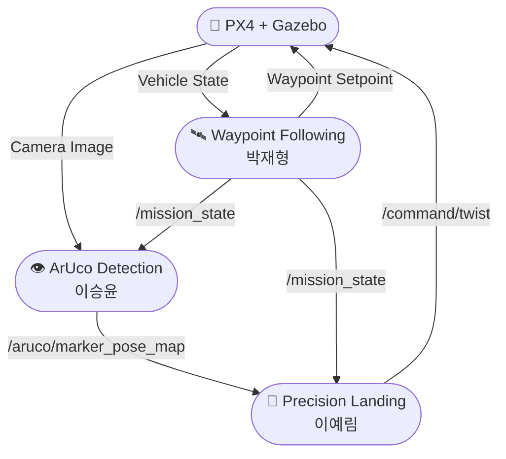

# 🚁 UAV Subsystem

## 📌 시스템 개요

UAV 서브시스템은 드론의 탐색 비행, ArUco 마커 검출, 그리고 정밀 착륙 기능을 담당한다.

드론은 미리 정의된 waypoint를 따라 비행하며 UGV를 탐색한다. UAV 카메라에서 ArUco Marker가 검출되면 검출 노드가 마커 위치를 계산하여 발행하고, Precision Landing 노드가 이를 이용해 드론을 마커 중심으로 정렬한 후 착륙을 수행한다.

---

## 📌 시스템 아키텍처



---

## 💻 담당자별 통신 명세

### 1. 이승윤 - ArUco Marker Detection (`uav_aruco_detector`)

#### Subscribe

| Topic                   | Type                |
| ----------------------- | ------------------- |
| `/uav/camera/image_raw` | `sensor_msgs/Image` |
| `/mission_state`        | `std_msgs/Int32`    |

#### Publish

| Topic                    | Type                        |
| ------------------------ | --------------------------- |
| `/aruco/marker_id`       | `std_msgs/Int32`            |
| `/aruco/marker_pose`     | `geometry_msgs/PoseStamped` |
| `/aruco/marker_pose_map` | `geometry_msgs/PoseStamped` |

#### 역할

* UAV 카메라 영상 수신
* ArUco Marker 검출
* Marker ID 추출
* Marker 위치 계산
* Marker 위치를 map frame 기준으로 변환 후 발행

---

### 2. 박재형 - PX4 Waypoint Following (`uav_waypoint_follower`)

#### Subscribe

| Topic              | Type                        |
| ------------------ | --------------------------- |
| UAV Local Position | `geometry_msgs/PoseStamped` |

#### Publish

| Topic             | Type                 |
| ----------------- | -------------------- |
| Waypoint Setpoint | PX4 Offboard Message |
| `/mission_state`  | `std_msgs/Int32`     |

#### 역할

* Waypoint 기반 탐색 비행
* 미션 상태 관리
* PX4 Offboard 제어

---

### 3. 이예림 - Precision Landing (`uav_precision_landing`)

#### Subscribe

| Topic                    | Type                        |
| ------------------------ | --------------------------- |
| `/aruco/marker_pose_map` | `geometry_msgs/PoseStamped` |
| `/mission_state`         | `std_msgs/Int32`            |

#### Publish

| Topic            | Type                  |
| ---------------- | --------------------- |
| `/command/twist` | `geometry_msgs/Twist` |

#### 역할

* ArUco Marker 위치 수신
* Marker 중심 정렬
* 정렬 오차 계산
* 착륙 제어 명령 생성
* 정밀 착륙 수행

---

## 📌 UAV 미션 시퀀스

```text
1. Waypoint Following 시작

        ↓

2. UAV 탐색 비행

        ↓

3. ArUco Marker 검출

        ↓

4. /aruco/marker_pose_map 발행

        ↓

5. Precision Landing 시작

        ↓

6. Marker 중심 정렬

        ↓

7. 하강

        ↓

8. 정밀 착륙 완료
```
