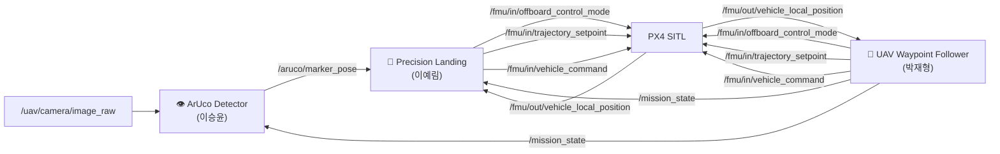

# 🚁 UAV Subsystem

UAV Subsystem은 드론의 자율 탐색, ArUco Marker 검출, 정밀 착륙 기능을 담당한다.

총 3개의 ROS2 노드로 구성되며, PX4 Offboard Control을 이용하여 UAV를 제어한다.

---

# System Architecture



---

# Node Specification

## 👁️ ArUco Detector (이승윤)

### Description

UAV 카메라 영상을 이용하여 ArUco Marker를 검출하고 마커의 위치 정보를 계산한다.

### Subscribe

| Topic                 | Type                  |
| --------------------- | --------------------- |
| /uav/camera/image_raw | sensor_msgs/msg/Image |
| /mission_state        | std_msgs/msg/Int32    |

### Publish

| Topic              | Type                          |
| ------------------ | ----------------------------- |
| /aruco/marker_pose | geometry_msgs/msg/PoseStamped |

---

## 🚁 UAV Waypoint Follower (박재형)

### Description

Waypoint 기반 자율 비행을 수행하며, 탐색 완료 후 Precision Landing 단계로 전환한다.

### Subscribe

| Topic                           | Type                              |
| ------------------------------- | --------------------------------- |
| /fmu/out/vehicle_local_position | px4_msgs/msg/VehicleLocalPosition |

### Publish

| Topic                         | Type                             |
| ----------------------------- | -------------------------------- |
| /fmu/in/offboard_control_mode | px4_msgs/msg/OffboardControlMode |
| /fmu/in/trajectory_setpoint   | px4_msgs/msg/TrajectorySetpoint  |
| /fmu/in/vehicle_command       | px4_msgs/msg/VehicleCommand      |
| /mission_state                | std_msgs/msg/Int32               |

---

## 🎯 Precision Landing (이예림)

### Description

ArUco Marker의 위치 정보를 이용하여 UAV를 마커 중심으로 유도하고 정밀 착륙을 수행한다.

### Subscribe

| Topic                           | Type                              |
| ------------------------------- | --------------------------------- |
| /aruco/marker_pose              | geometry_msgs/msg/PoseStamped     |
| /mission_state                  | std_msgs/msg/Int32                |
| /fmu/out/vehicle_local_position | px4_msgs/msg/VehicleLocalPosition |

### Publish

| Topic                         | Type                             |
| ----------------------------- | -------------------------------- |
| /fmu/in/offboard_control_mode | px4_msgs/msg/OffboardControlMode |
| /fmu/in/trajectory_setpoint   | px4_msgs/msg/TrajectorySetpoint  |
| /fmu/in/vehicle_command       | px4_msgs/msg/VehicleCommand      |

---

# Mission State

| State | Description       |
| ----- | ----------------- |
| 0     | Exploration       |
| 1     | Precision Landing |

---

# Control Flow

```text
Exploration

UAV Waypoint Follower
        ↓
Mission Complete
        ↓
mission_state = 1
        ↓
Precision Landing
        ↓
ArUco Tracking
        ↓
Precision Landing
```

---

# Command Ownership

동일한 `/fmu/in/trajectory_setpoint` 토픽을 사용하므로 두 노드가 동시에 제어 명령을 발행하지 않는다.

```text
mission_state = 0
→ UAV Waypoint Follower 활성

mission_state = 1
→ Precision Landing 활성
```
