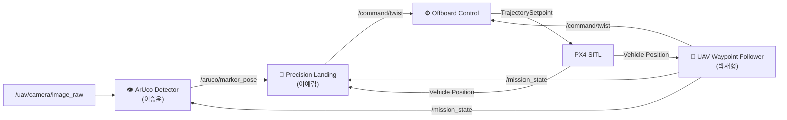

# 🚁 UAV Subsystem

UAV Subsystem은 드론의 자율 탐색, ArUco Marker 검출 및 정밀 착륙 기능을 담당한다.

총 3개의 ROS2 노드로 구성되며, UAV 제어 명령은 `/command/twist` 토픽을 통해 PX4 Offboard Controller로 전달된다.

---

# System Architecture



---

# Node Specification

## 👁️ ArUco Detector (이승윤)

### Description

UAV 카메라 영상을 이용하여 ArUco Marker를 검출하고 위치를 계산한다.

### Subscribe

| Topic                 | Type                  |
| --------------------- | --------------------- |
| /uav/camera/image_raw | sensor_msgs/msg/Image |
| /mission_state        | std_msgs/msg/Int32    |

### Publish

| Topic              | Type                          |
| ------------------ | ----------------------------- |
| /aruco/marker_pose | geometry_msgs/msg/PoseStamped |

---

## 🚁 UAV Waypoint Follower (박재형)

### Description

Waypoint 기반 자율 비행을 수행하며 탐색 완료 후 Precision Landing 단계로 전환한다.

### Subscribe

| Topic            | Type               |
| ---------------- | ------------------ |
| Vehicle Position | PX4 Local Position |

### Publish

| Topic          | Type                    |
| -------------- | ----------------------- |
| /command/twist | geometry_msgs/msg/Twist |
| /mission_state | std_msgs/msg/Int32      |

---

## 🎯 Precision Landing (이예림)

### Description

ArUco Marker의 상대 위치를 이용하여 UAV를 마커 중심으로 유도하고 정밀 착륙을 수행한다.

### Subscribe

| Topic              | Type                          |
| ------------------ | ----------------------------- |
| /aruco/marker_pose | geometry_msgs/msg/PoseStamped |
| /mission_state     | std_msgs/msg/Int32            |
| Vehicle Position   | PX4 Local Position            |

### Publish

| Topic          | Type                    |
| -------------- | ----------------------- |
| /command/twist | geometry_msgs/msg/Twist |

---

# Mission State

| State | Description       |
| ----- | ----------------- |
| 0     | Exploration       |
| 1     | Precision Landing |

---

# Control Ownership

```text
mission_state = 0
→ UAV Waypoint Follower 활성
→ Precision Landing 비활성

mission_state = 1
→ Precision Landing 활성
→ UAV Waypoint Follower 비활성
```

동일한 `/command/twist` 토픽을 사용하므로 두 노드가 동시에 명령을 발행하지 않는다.

---

# UAV Control Flow

```text
ArUco Detector
      ↓
/aruco/marker_pose
      ↓
Precision Landing
      ↓
/command/twist
      ↓
Offboard Control
      ↓
PX4 SITL
      ↓
UAV
```
