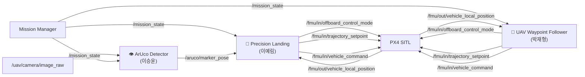

# 🚁 UAV Subsystem

UAV Subsystem은 드론의 자율 탐색(Exploration), ArUco Marker 검출, 정밀 착륙(Precision Landing) 기능을 담당한다.

총 3개의 ROS2 노드로 구성되며, PX4 Offboard Control을 이용하여 UAV를 제어한다.

---

# System Architecture



---

# Node Specification

## 👁️ ArUco Detector (이승윤)

### Description

UAV 카메라 영상을 이용하여 ArUco Marker를 검출하고 마커의 위치 정보를 계산한다.

### Subscribe

| Topic                 | Type                  |
| --------------------- | --------------------- |
| /uav/camera/image_raw | sensor_msgs/msg/Image |
| /mission_state        | std_msgs/msg/Int32    |

### Publish

| Topic              | Type                          |
| ------------------ | ----------------------------- |
| /aruco/marker_pose | geometry_msgs/msg/PoseStamped |

---

## 🚁 UAV Waypoint Follower (박재형)

### Description

Mission 2 단계에서 UAV의 이륙 및 탐사(Exploration)를 수행한다.

탐사 지점을 순회하며 ArUco Marker를 탐색하고, 탐색 완료 후 Rendezvous Point로 이동한다.

### Subscribe

| Topic                           | Type                              |
| ------------------------------- | --------------------------------- |
| /mission_state                  | std_msgs/msg/Int32                |
| /fmu/out/vehicle_local_position | px4_msgs/msg/VehicleLocalPosition |

### Publish

| Topic                         | Type                             |
| ----------------------------- | -------------------------------- |
| /fmu/in/offboard_control_mode | px4_msgs/msg/OffboardControlMode |
| /fmu/in/trajectory_setpoint   | px4_msgs/msg/TrajectorySetpoint  |
| /fmu/in/vehicle_command       | px4_msgs/msg/VehicleCommand      |

---

## 🎯 Precision Landing (이예림)

### Description

Mission 4 단계에서 활성화되는 노드로, ArUco Marker의 위치 정보를 이용하여 UAV를 마커 중심으로 유도하고 UGV 상부에 정밀 착륙을 수행한다.

Precision Landing 노드는 Mission State를 구독하며 Mission 4 상태에서만 제어 명령을 생성한다.

### Subscribe

| Topic                           | Type                              |
| ------------------------------- | --------------------------------- |
| /mission_state                  | std_msgs/msg/Int32                |
| /aruco/marker_pose              | geometry_msgs/msg/PoseStamped     |
| /fmu/out/vehicle_local_position | px4_msgs/msg/VehicleLocalPosition |

### Publish

| Topic                         | Type                             |
| ----------------------------- | -------------------------------- |
| /fmu/in/offboard_control_mode | px4_msgs/msg/OffboardControlMode |
| /fmu/in/trajectory_setpoint   | px4_msgs/msg/TrajectorySetpoint  |
| /fmu/in/vehicle_command       | px4_msgs/msg/VehicleCommand      |

---

# Mission State

| State | Description            |
| ----- | ---------------------- |
| 0     | UGV Waypoint Following |
| 1     | UAV Exploration        |
| 2     | UGV Rendezvous         |
| 3     | UAV Precision Landing  |
| 4     | Mission Complete       |

---

# Mission Flow

```text
Mission 1
UGV Waypoint Following
        ↓
Marker ID 0 Detected
        ↓

Mission 2
UAV Takeoff
        ↓
Exploration
        ↓
ArUco Detection
        ↓
Move to Rendezvous Point
        ↓

Mission 3
UGV Obstacle Avoidance
        ↓
Move to Rendezvous Point
        ↓

Mission 4
Precision Landing
        ↓
ArUco Tracking
        ↓
Marker Alignment
        ↓
Descent
        ↓
Landing Complete
```

---

# Precision Landing Control Flow

```text
mission_state == 3
        ↓
Receive Marker Pose
        ↓
Calculate Position Error
        ↓
Generate Trajectory Setpoint
        ↓
Align with Marker Center
        ↓
Descend
        ↓
Landing
```

---

# Command Ownership

동일한 PX4 Offboard Control 토픽을 사용하므로 각 노드는 Mission State에 따라 제어 권한을 가진다.

```text
mission_state = 1
→ UAV Waypoint Follower 활성

mission_state = 3
→ Precision Landing 활성
```

이를 통해 두 노드가 동시에 제어 명령을 발행하는 상황을 방지한다.

```
```
